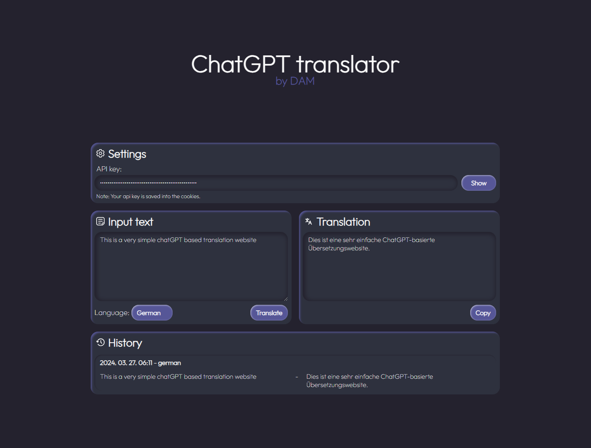

# gptTranslator
Website by DAM

Check out in action!
https://www.damdev.xyz/Content/gptTranslator/

## How to use
- You need an openAi api to use the website.
 Note: After you entered your api key, the website saves it into the cookies, so next time you dont have to enter it.
- Enter a text into the "Input text" textfield.
- Choose target language
- Press "Translate"!

## Features
- Auto language detection
- History list from the translations
- Api key cookie saving
- Cool UI! :D